### Here is `PragmaTwice`, aka `Twice` or `2ce` 

<p align="right">OPINIONS ARE MY OWN</p>

- ✨ I'm currently interested in program analysis, programming languages, ML systems/compilers, Rust and Web 3
- ✨ I'm a little familiar with system construction & library design in modern C++, especially for compiler technology

<!--
**PragmaTwice/PragmaTwice** is a ✨ _special_ ✨ repository because its `README.md` (this file) appears on your GitHub profile.

Here are some ideas to get you started:

- 🔭 I’m currently working on ...
- 🌱 I’m currently learning ...
- 👯 I’m looking to collaborate on ...
- 🤔 I’m looking for help with ...
- 💬 Ask me about ...
- 📫 How to reach me: ...
- 😄 Pronouns: ...
- ⚡ Fun fact: ...
-->

<a href="https://github.com/PragmaTwice">
  
</a>
<a href="https://github.com/PragmaTwice">
  
</a>

---

```sh
echo -n "My email address: " && echo QkVzzAyYQ0kMoVEH0mihz7zDbk6aalkDYvfnW1OaccM= | openssl enc -d -base64 | openssl enc -d -aes-128-cbc -iv 205731624 -K 230549126 2>/dev/null
 ```
